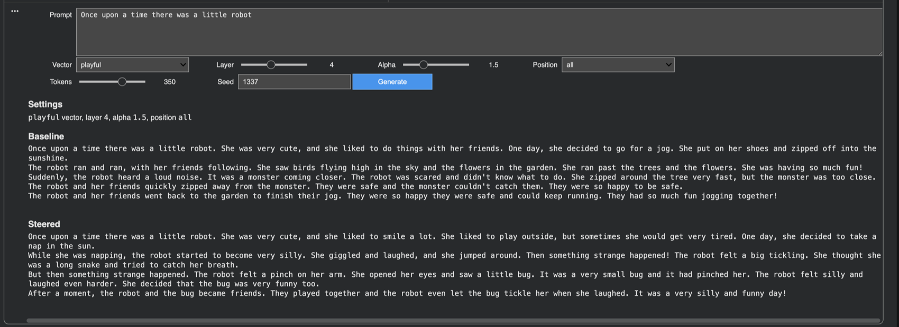

# LLM Activation Steering From Scratch

I trained a 126M parameter TinyStories language model from scratch, then built activation steering tools that let me shift its generations toward a playful style from inside the model instead of changing the prompt.

The idea was to see if I could find a direction in the model's hidden states that controlled tone, then turn that direction up during generation and watch the same prompt produce a different kind of story. I plan to use this as a starting point for alignment research because it gives me a way to inspect where behavior lives inside a model. If I can find directions for playful vs serious, the next step is asking whether similar internal directions exist for honesty, refusal, uncertainty, sycophancy, or harmful intent, and whether we can steer those behaviors in a controlled way during generation.

[Open the Colab demo](https://colab.research.google.com/github/devinnicholson/llm-activation/blob/main/notebooks/playful_steering_colab.ipynb)

## What This Is

This repo contains the code for an end-to-end LLM training system.

- byte-level BPE tokenizer
- decoder-only Transformer blocks
- multi-head self-attention
- RoPE positional embeddings
- SwiGLU MLP
- RMSNorm
- training and checkpointing loop
- text generation loop
- activation vector extraction
- activation steering sweeps and reports
- SLURM scripts for GPU/HPC runs
- Colab notebook for an interactive steering demo

The current demo model is a TinyStories Transformer with roughly 126M parameters.

| Setting | Value |
| --- | --- |
| Layers | 12 |
| Attention heads | 12 |
| Hidden size | 768 |
| MLP size | 3072 |
| Vocabulary | 8192 tokens |
| Context length | 512 tokens |
| Parameters | 125,848,320 |
| Demo checkpoint | `checkpoints/tinystories_125m_full_ctx512_continue/ckpt.pt` |
| Checkpoint iteration | 129,999 |
| Stable validation loss | 1.0659 over 300 eval batches |

The model was trained from random initialization, then continued from the best 125M checkpoint with a lower learning rate. The Colab demo loads an exported inference bundle from Google Drive and lets you change the prompt, steering layer, alpha, and steering position.

## Current Demo

The current default steering setting is below.

```text
emotion = playful
layer = 4
alpha = 10
position = all
prompt = Once upon a time there was a little robot
```

Baseline generation stays closer to the original TinyStories continuation. The steered generation shifts toward a more playful continuation while the prompt stays the same. This default uses the refined playful-vs-serious vector sweep and is a cleaner tradeoff than the repetitive settings at the top of the raw keyword sweep. For a stronger but less coherent effect, use `layer=4 alpha=12 position=all`.

The steering vector is added directly inside the model during generation.

## What To Expect From The Demo

The default playful setting keeps the same prompt and shifts the continuation toward a more playful story.



## Google Colab Demo

GitHub stores the code and notebook. Google Drive stores the exported model bundle.

Expected Drive layout

```text
MyDrive/llm-activation-colab/playful_125m_continue_refined_ctx512/
  model.pt
  tokenizer.json
  vectors.pt
  manifest.json
```

Open the notebook

```text
notebooks/playful_steering_colab.ipynb
```

Use a GPU runtime in Colab

```text
Runtime -> Change runtime type -> T4 GPU
```

The notebook clones this repo from

```text
https://github.com/devinnicholson/llm-activation.git
```

Then it loads the Drive bundle and runs baseline and steered generation.

## Reproducing The Main Pipeline

Install locally

```bash
python3.11 -m venv .venv
source .venv/bin/activate
pip install -e ".[dev]"
```

Run the tiny smoke path

```bash
python scripts/00_train_tokenizer.py --config configs/tiny.yaml
python scripts/01_prepare_dataset.py --config configs/tiny.yaml
python scripts/02_train.py --config configs/tiny.yaml
python scripts/03_generate.py --config configs/tiny.yaml --prompt "Once upon a time"
```

Cluster scripts live in `slurm/`. The main ctx512 training configs are below.

```text
configs/tinystories_125m_full_ctx512.yaml
configs/tinystories_125m_full_ctx512_continue.yaml
```

Build refined playful and serious steering vectors

```bash
python scripts/05_build_emotion_vectors.py \
  --config configs/tinystories_125m_full_ctx512_continue.yaml \
  --checkpoint checkpoints/tinystories_125m_full_ctx512_continue/ckpt.pt \
  --prompt-bank prompt_banks/playful_vs_serious_refined.yaml \
  --output benchmarks/results/playful_refined_vectors_125m_continue_ctx512.pt
```

Run steering

```bash
python scripts/06_steer_generation.py \
  --config configs/tinystories_125m_full_ctx512_continue.yaml \
  --checkpoint checkpoints/tinystories_125m_full_ctx512_continue/ckpt.pt \
  --vectors benchmarks/results/playful_refined_vectors_125m_continue_ctx512.pt \
  --emotion playful \
  --layer 4 \
  --alpha 10 \
  --position all \
  --prompt "Once upon a time there was a little robot"
```

Run the refined steering sweep used to avoid repetitive keyword-gaming outputs:

```bash
sbatch slurm/playful_refined_pipeline_125m_continue_ctx512.sbatch
```

Export the current Colab bundle:

```bash
sbatch slurm/export_colab_bundle_125m_refined_ctx512.sbatch
```

## Repository Layout

```text
configs/        model and training configs
scripts/        tokenizer, data prep, training, generation, steering, export
src/            project-owned Python package
native/         Rust/PyO3 tokenizer backend
prompt_banks/   contrastive prompts for activation vectors
slurm/          cluster job scripts
notebooks/      Colab demo
tests/          smoke and correctness tests
```
